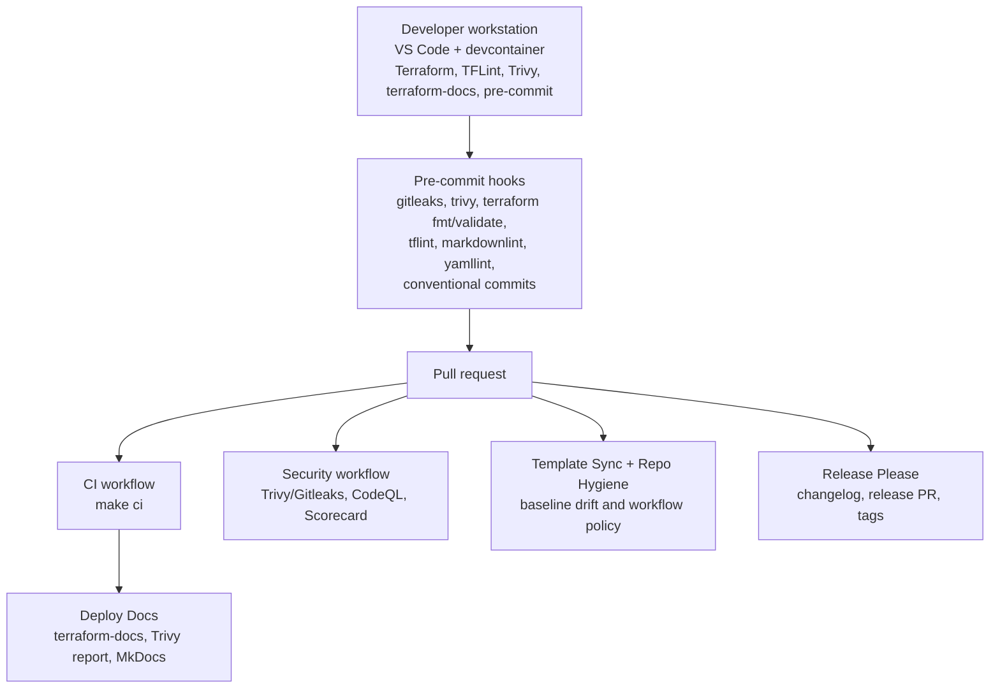
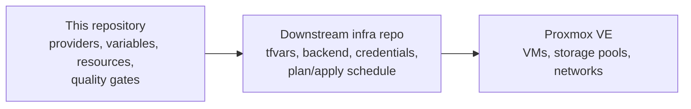

# Architecture

## Overview

This framework is the Proxmox Terraform layer for VM definitions. It keeps the
Terraform module, validation toolchain, documentation generation, and GitHub
Actions controls in the same repository so changes to infrastructure behavior
and changes to quality gates can be reviewed together.

## GitOps Flow



## Framework Consumption Pattern

This repo is a framework: it defines provider configuration, reusable module
shape, and validation rules. Downstream repos consume it to deploy actual
infrastructure and own state, credentials, backend configuration, and
environment-specific `tfvars`.



## Security Control Layers

| Layer | Controls |
| --- | --- |
| Local | pre-commit hooks for secret scanning, formatting, Terraform validation, linting, and commit message format |
| PR and push CI | `CI`, `Security`, `Template Sync`, and `Repo Hygiene` workflows |
| Continuous | Scheduled security and repo-hygiene runs plus Dependabot dependency PRs |
| Supply chain | SHA-pinned Actions, `persist-credentials: false`, exact Terraform/provider pins |

## Repository Structure

```text
proxmox-terraform-framework/
|-- .config/                    # Tool configuration
|-- .devcontainer/              # Reproducible development environment
|-- .github/
|   |-- actions/                # Local Terraform composite actions
|   `-- workflows/
|       |-- ci.yaml
|       |-- security.yaml
|       |-- template-sync.yaml
|       |-- repo-hygiene.yaml
|       |-- pages.yaml
|       |-- release-please.yaml
|       `-- terraform.yaml
|-- .vscode/                    # Workspace settings and tasks
|-- docs/                       # MkDocs source
|-- examples/                   # Usage examples
|-- requirements/               # Pinned Python dependencies
|-- terraform/                  # Core Terraform configuration
|-- .pre-commit-config.yaml
|-- release-please-config.json
`-- .release-please-manifest.json
```
